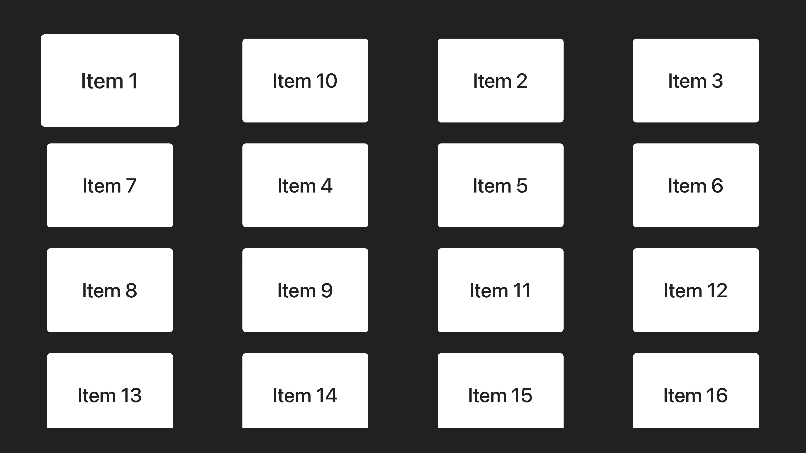
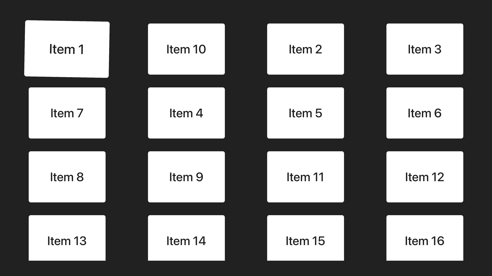

# Sample tvOS app with cell reordering

## Instructions

- Do a long press to toggle edit mode
- Move to the desired cell then do a tap ("select" gesture) to select the cell to move
  - Once active, the cell will "wiggle"
- Move the cell up/down and left/right as desired
- Do a tap again to unselect the cell
- Do a long press to choose whether to commit or discard the changes

## TODO

- [ ] Fix bug when quitting edit mode, focus is on incorrect cell. It should be on the last cell

## Screenshots

| Feature | Screenshot |
|---------|------------|
| Base |  |
| Edit |  |
| Wiggle |  |
| Commit |  |

[Demo video](Resources/demo.mp4)